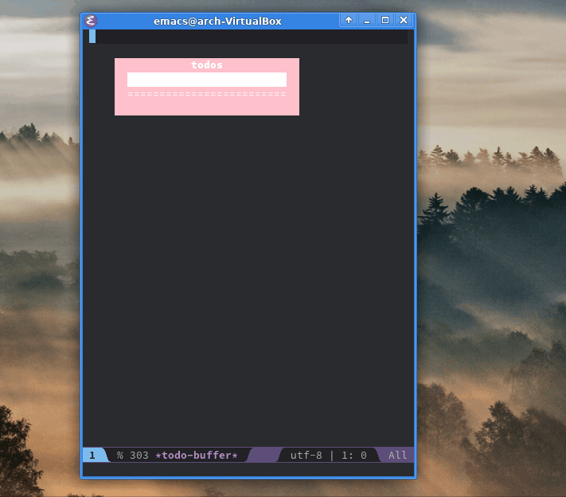

# rem.el [](https://www.gnu.org/licenses/gpl-3.0) []() []()

Main purpose of **rem.el** is to simplify building text interfaces for Emacs. It provides a bunch of utilities that when combined together allow to structure your code in the MVC way. At the core, what it does is memoizing, but without potential memory leaks. The approach is similar to React/Redux, but simpler and adapted for Emacs reality.

Stop *losing your religion* trying to hack together a text interface for your package! :)

## Overview

Consider the following code:

```elisp
(defvar todo-entries '("eat" "hack" "repeat")
  "ToDo list.")

(defvar todo-selected 0
  "Index of the selected ToDo entry.")

(rem-defcomponent todo (entry selected)
  "ToDo entry component."
  (if selected (upcase entry) entry))

(rem-defcomponent todos (entries index)
  "ToDo list component."
  (s-join "|" (--map-indexed (todo it (eq it-index index)) entries)))
  
(rem-view view ()
  "Main view."
  (todos todo-entries todo-selected))
```

Both `rem-defcomponent` and `rem-defview` seem like regular functions and indeed they are (they support `&optional`, `&rest` and docstrings), but with one exception: components can be called only from the view and other components. When you call `(view)` the first time it will return `EAT|hack|repeat` as expected. If you call it again, the result will be the same, but this time the `todos` component won't be called and memoized results will be reused instead. *"But it's just memoization, big deal!"*, right? Well, yes, but what if you call it 100 times slightly changing your data each time? What if you call it 1000 times? Memoizing everything is not a very good option when it comes to building UI.

How about memoizing only the last value and render the component once parameters change? It's better, but it doesn't work for lists: the `todo` component would always be recalculated, because each time it would be called for a different entry. Also, this means that we can't reuse components.

How about memoizing only those values that components produced during the last time we called `(view)`? It's more robust, but consider this: if we call `(view)` two times in a row without changing our data, then add a new entry and call `(view)` again, the `(todo)` component would be recalculated for all previous entries as well, because when we called `(view)` the second time we had reused the `todos` component last value which led to the `todo` component not being called.

What **rem.el** does is it maintains dependencies between components and keeps their memoized values between renders if they were called directly or indirectly (i.e. by reusing values of higher order components that depend on them). Components remain completely stateless while the view is responsible for maintaining context of the previous render and passing it to components. This way we only apply patches on each render instead of recalculating everything.

Cool! So does it help to adhere to MVC? For this, **rem.el** provides a helper:

`rem-bind (buffer view actions &optional save-point)` — it binds a view (or any function, really) to a buffer and renders it after each action (which are regular functions) optionally restoring the point to position defined by `save-point`. Here's how it works: 

```elisp
(defun add-todo (content)
  "Add a new ToDo entry."
  (push content todo-entries))

(rem-bind "*todo-buffer*" 'view '(add-todo) (lambda () 0))
```

That's it, folks.

## Components

The following components are provided together with **rem.el**:

* `rem-block (content &rest props)` — it's like a `<div>`, but made of text. It supports borders, text align, word wrapping, etc.
* `rem-join (direction align &rest blocks)` — joins blocks of text either horizontally of vertically and aligns them.

## Example

You can look up the source of the following example [here](rem-example.el):



Please, note that the inteface itself it's not this slow (it's actually pretty fast!). It's just that GIF FPS is rather low.

## Implementation

Under the hood, **rem.el** maintains context for each view which consists of three things: `rem--prev-hash`, `rem--next-hash` and `rem--deps-stack`. The first two are hash tables with component names as keys and hash tables as values. Those hash tables in turn have parameters lists as keys and cons cells as values. Cons cells contain a value that a component have produced for specific parameters as `car` and a list of dependencies on other components as `cdr`. The list of dependencies in turn consists of cons cells with components names as `car` and parameters lists as `cdr`. When a view is called, it passes its context to components which in turn check if memoized results for the current parameters exist. If they exist, they are copied to a new hash table along with their dependencies. Otherwise, a component pushes itself to the top list in dependencies stack, then a new list is pushed to a dependency stack and a component is called and memoized as usual. Yep, it's a bit of an overkill for simple components, but for a more complex logic it makes a lot of sense (also, it's consistent).

## Gotchas

* Make sure to enable lexical binding if you plan on using **rem.el**, because it relies on it.
* Currently, `rem-block` doesn't handle different font sizes in a single block. Use at your own risk.
* If you're creating a lot of small components, you're basically trading performance for space.

## Contribute

If you have any ideas on how to improve the approach for a better developer experience, please create an issue.  
If you have a generally useful component from which others can benefit, please send a PR.
